## Афанасьєв Михайло IПЗ 3.02 Практична-Лабораторна робота № 8

## Тема: Неперервна інтеграція
## Мета: ознайомитися з принципами і практиками неперервної інтеграції, сформувати навички автоматизації CI/CD процесів в GitHub Actions

## 1) Починаємо першу практичну роботу на GitHub Skills за наступним посиланням https://github.com/skills/hello-github-actions?tab=readme-ov-file

#### 1. Переходимо за посиланням та натискаємо на кнопку ``Start course`` та створюємо репозиторій:
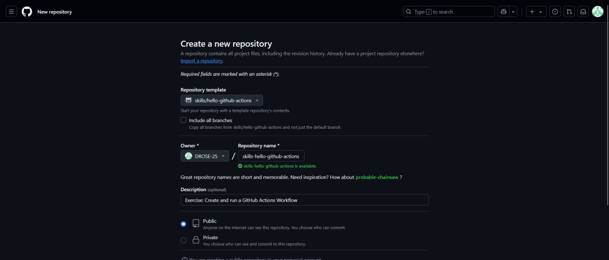
#### Рис. 1 - Створення репозиторія

#### 2. Переходимо на сторінку ``Pull requests``, натискаємо на створення нового Пулл запиту та налаштовуємо запит наступним чином:
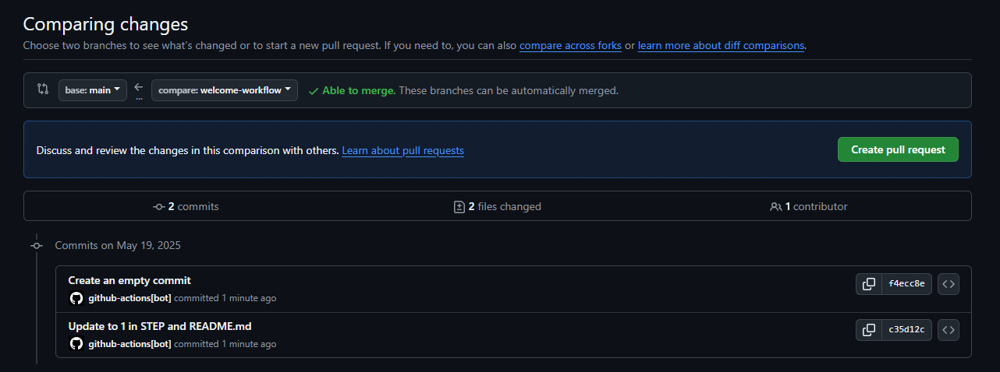

#### Рис. 2 - Створення пулл запиту

#### 3. Переходимо на сторінку ``Code``, натискаємо на гілку та обираємо нову створену гілку ``welcome-workflow``:

#### 4. Переходимо в папку ``.github/workflows``, створюємо новий файл ``welcome.yml`` та додаємо в нього наступний зміст:
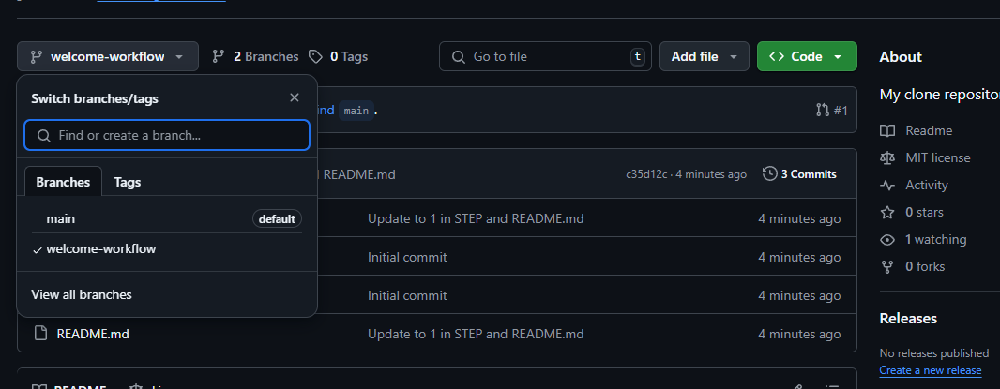
#### Рис. 3 - Створення файла welcome.yml

#### 5. Натискаємо на кнопку ``Commit changes`` та підтверджуємо створення нового файлу, впевневшись що ми коммітимо цей файл в корректну гілку ``welcome-workflow``:
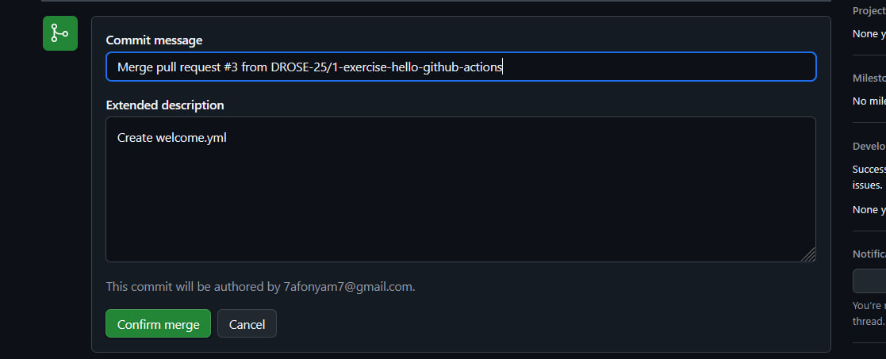
#### Рис. 4 - Підтвердження створення файлу

#### 6. Чекаємо пів хвилини та перезавантажуємо сторінку, зміст сторінки readme змінется, потім відкриваємо файл ``welcome.yml`` та змінюємо його зміст наступним чином:
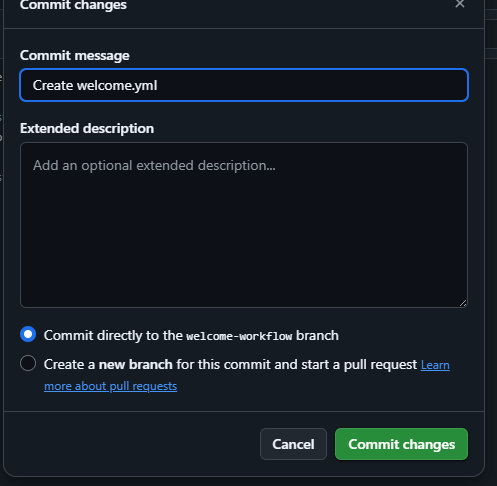
#### Рис. 5 - Додавання роботи файлу welcome.yml

#### 7. Чекаємо пів хвилини, відкриваємо файл ``welcome.yml`` та знову змінюємо його зміст наступним чином:
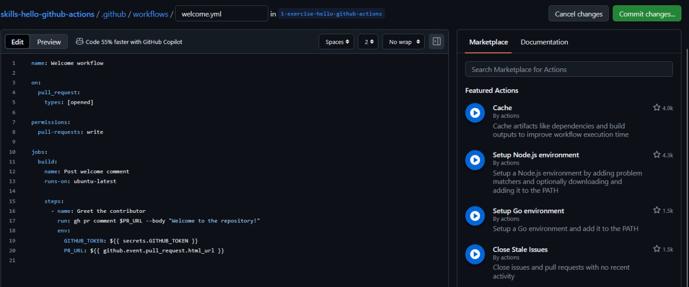
#### Рис. 6 - Додавання шагу файлу welcome.yml

#### 8. Потім натискаємо на сторінку ``Pull requests``, потім на створенний запит із другого пункта і потім на кнопку ``Merge pull request`` та підтверджуєм:
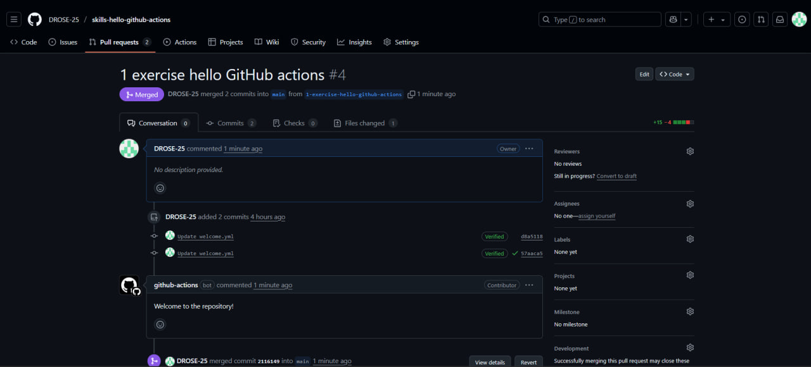
#### Рис. 7 - Сливання гілок

#### 9. Опціонально видаляємо гілку ``welcome-workflow``:
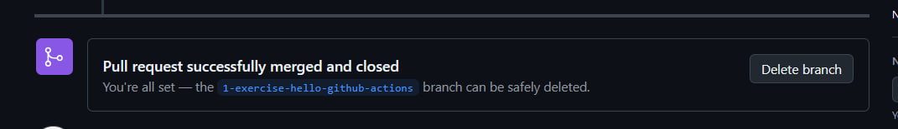
#### Рис. 8 - Видалення не потрібної гілки

## 2) Починаємо другу практичну роботу на GitHub Skills за наступним посиланням https://github.com/skills/hello-github-actions?tab=readme-ov-file

#### 1. Переходимо за посиланням та натискаємо на кнопку ``Start course``, створюємо репозиторій:
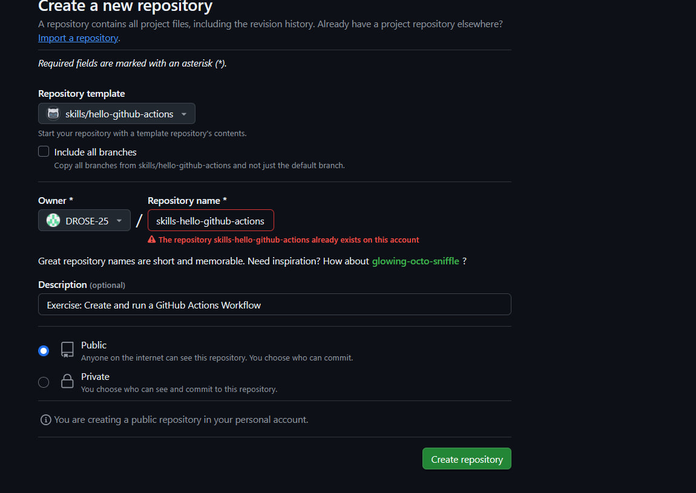
#### Рис. 9 - Створення репозиторія

#### 2. Переходимо на сторінку ``Code``, потім на гілку ``cd``, потім в директорію ``.github/workflows/``:
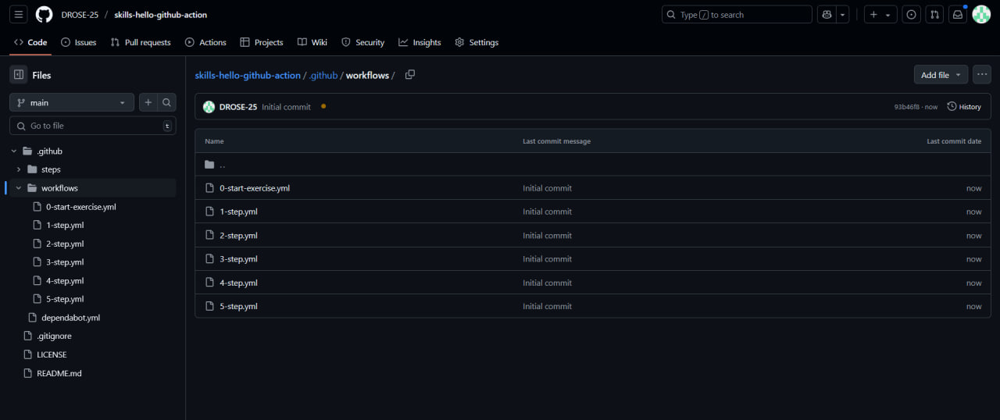
#### Рис. 10 - Переход в гілку та в директорію

#### 3. Створюємо файл ``publish.yml``, з наступним змістом:
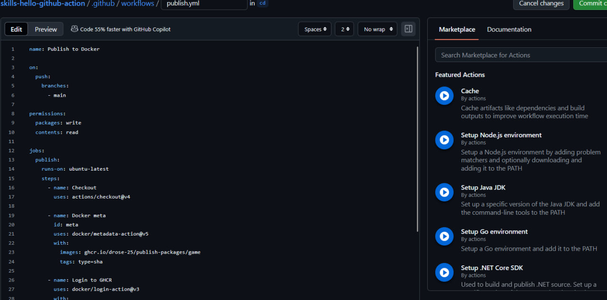
#### Рис. 11 - Створення файла publish.yml

#### 4. Переходимо на сторінку ``Pull requests``, натискаємо на створення нового Пулл запиту та налаштовуємо запит наступним чином:
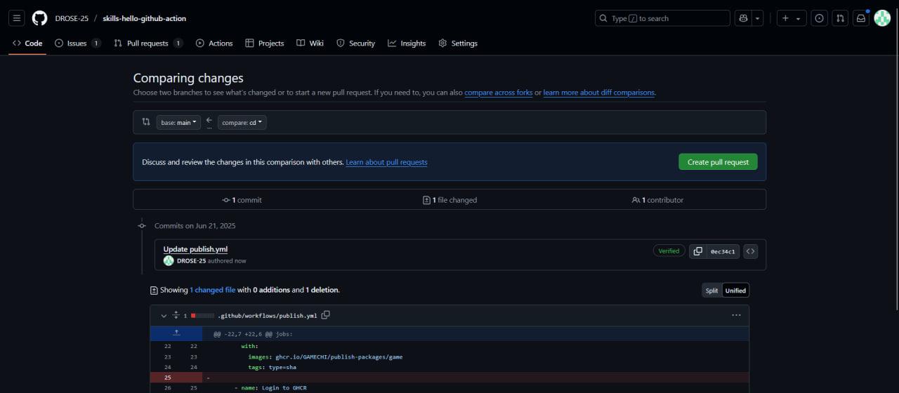
#### Рис. 12 - Створення пулл запиту

#### 5. В гілці ``cd`` створюємо ``Dockerfile`` з наступним змістом:
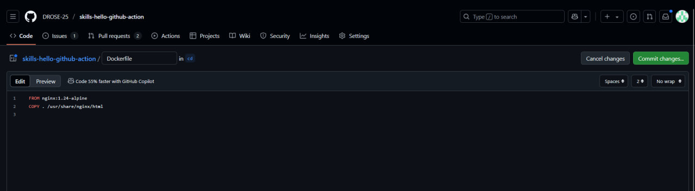
#### Рис. 13 - Створення Dockerfile

#### 6. Потім натискаємо на сторінку ``Pull requests``, потім на створенний запит із четвертого пункта і потім на кнопку ``Merge pull request`` та підтверджуєм(опціонально видаляєм гілку ``cd``):
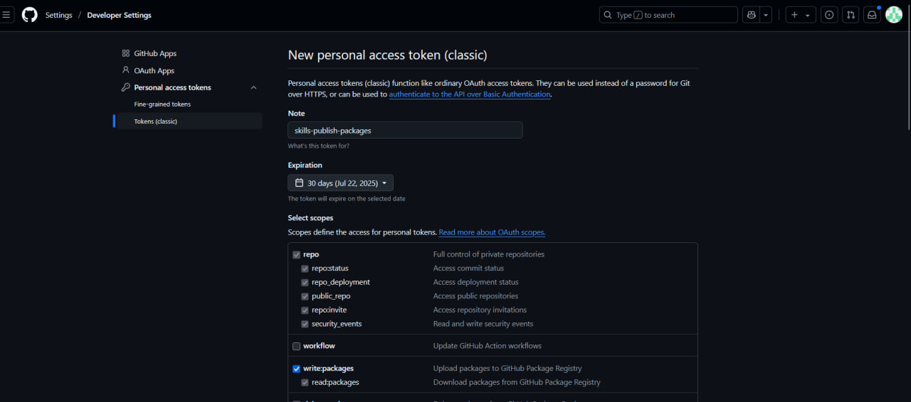
#### Рис. 14 - Сливання гілок

#### 7. Запускаємо ``Docker Desktop for Windows``:
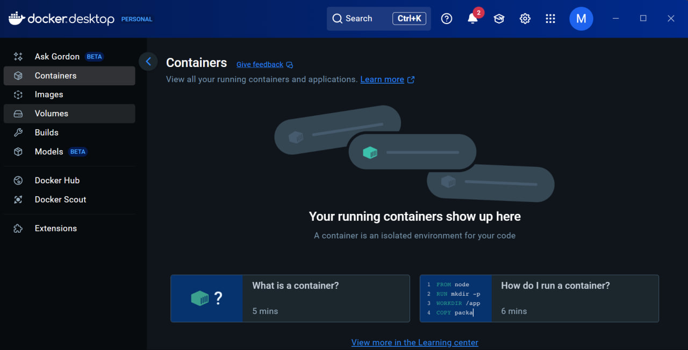
#### Рис. 15 - Запуск докера

#### 8. Генеруємо токен в налаштуваннях свого гітхабу:

#### Рис. 16 - Генерування токену

#### 9. Прописуємо команду docker login ghcr.io -u USERNAME та потім вставляємо згенерований токен:
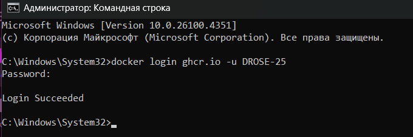
#### Рис. 17 - Логін в докер

#### 10. Потім прописуємо команду docker pull ghcr.io/YOURNAME/publish-packages/game:TAG та дивимся на результат:
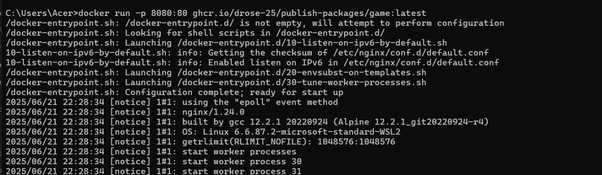
#### Рис. 19 - Пулл image

#### 11. Для находження інформації про ``image`` треба прописати наступну команду:
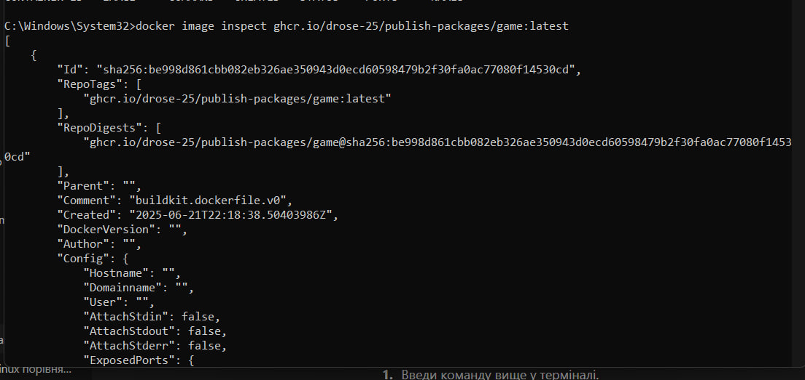
#### Рис. 20 - Інформація про image

#### 12. Потім запускаємо наступну команду docker run -dp 8080:80 --rm <YOUR_IMAGE_NAME:TAG> для запуску контейнера з image:
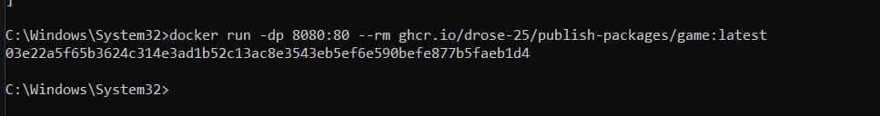
#### Рис. 21 - Запуск контейнера

#### 13. Перейдемо в докер та побачимо наш запущенний контейнер:
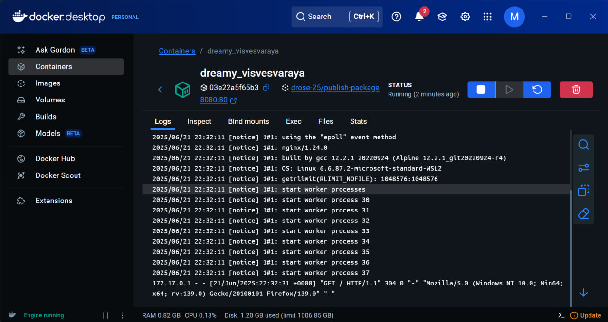
#### Рис. 22 - Запущений контейнер

#### 14. Та перейдемо на сторінку http://localhost:8080/ та побачимо результат наших дій:
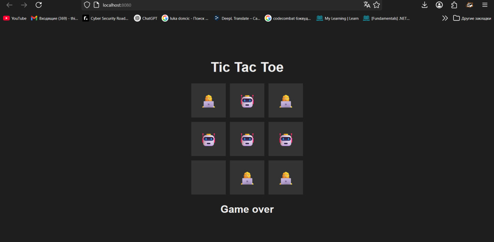
#### Рис. 23 - Сторінка http://localhost:8080/

## 3) Створення власного Workflow

#### 1. Відкриємо фронт-енд проект із лабораторної роботи №6 та запушимо його наступним чином:
git init
git remote add origin https://github.com/drose-25/lb-pr-front-end-8.git
git add .
git push -u origin main

#### 2. Відкриємо сторінку створенного гітхабу та подивимось на результат:
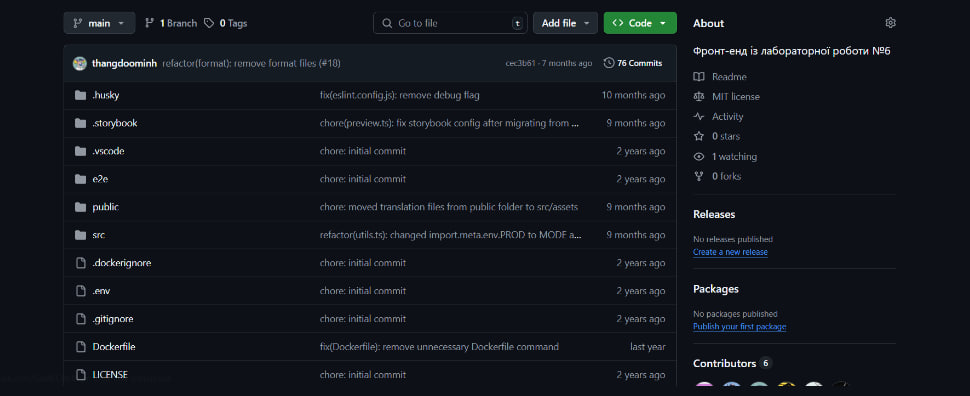
#### Рис. 25 - Запушений фроент-енд

#### 3. Створемо каталог ``.github``, в ньому каталог ``workflows``, і в ньому файл ``docker-build.yml`` з наступним змістом:
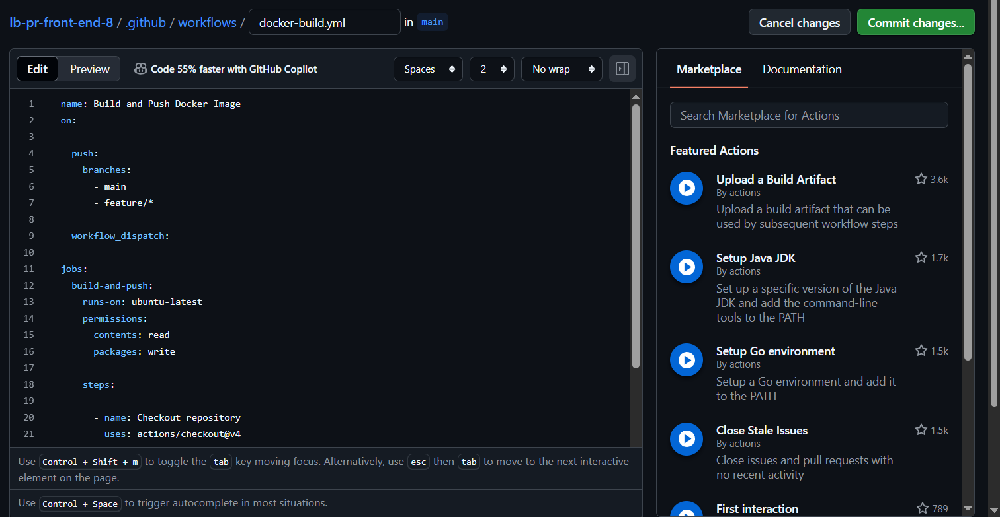
#### Рис. 26 - Файл docker-build.yml

#### 4. Перейдемо на сторінку ``Actions`` і побачимо що все працює корректно:

## Висновки: Протягом виконання лабораторно-практичної роботи я ознайомився з принципами і практиками неперервної інтеграції та сформував навички автоматизації CI/CD процесів в GitHub Actions
